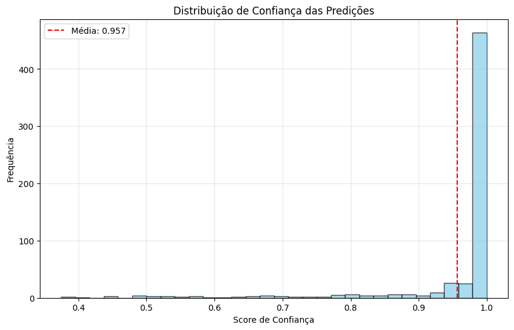
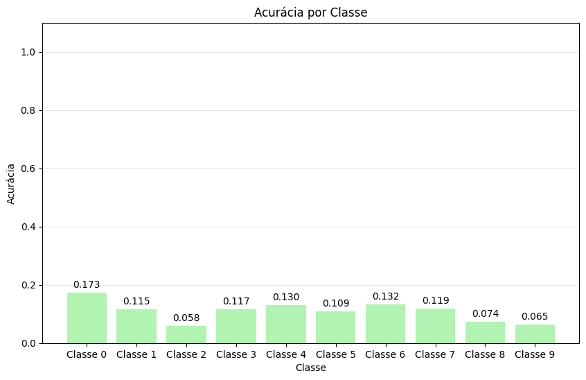
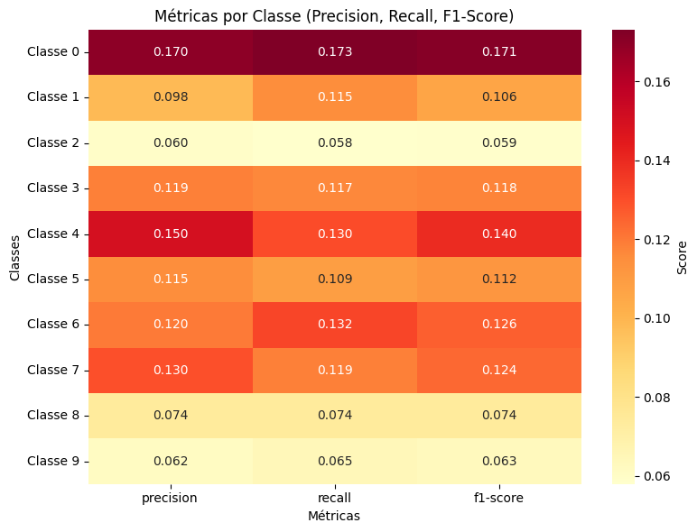
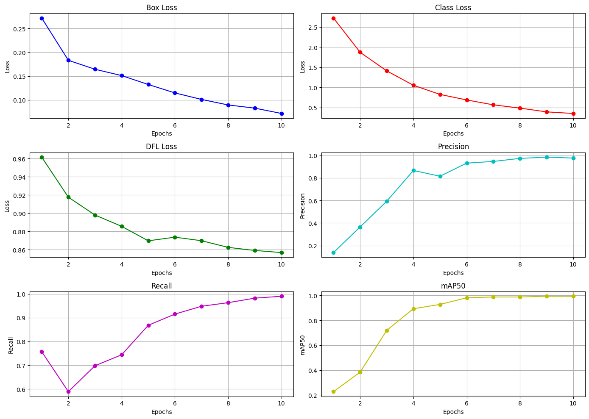

# 🫁 INF0417 - Seminário: Breath2Vision

Um projeto de visão computacional para detecção de doenças respiratórias usando espectrogramas de sons pulmonares e modelos de aprendizado profundo.

**Integrantes:**
- **202303331:** David O'Neil Campos
- **202303348:** José Ricardo Fleury
- **202303350:** Lucas Wanderley Alexandria Alves
- **202303360:** Priscila Rocha Maia Freitas Ribeiro

---

## 📋 Índice

- [🫁 INF0417 - Seminário: Breath2Vision](#-inf0417---seminário-breath2vision)
  - [📋 Índice](#-índice)
  - [🗣️ Apresentações](#️-apresentações)
  - [🔍 Introdução](#-introdução)
    - [🧩 Problema](#-problema)
    - [💡 Solução Proposta](#-solução-proposta)
  - [🔬 Metodologia](#-metodologia)
    - [📊 Dataset](#-dataset)
      - [🔊 ICBHI 2017 Respiratory Sound Database](#-icbhi-2017-respiratory-sound-database)
    - [📐 Métricas de Avaliação](#-métricas-de-avaliação)
  - [🎯 Resultados](#-resultados)
    - [CNN](#cnn)
      - [Métricas do modelo](#métricas-do-modelo)
    - [YOLO](#yolo)
      - [Métricas do modelo](#métricas-do-modelo-1)
  - [✅ Conclusões](#-conclusões)
    - [Possíveis próximos passos](#possíveis-próximos-passos)
  - [📚 Referências](#-referências)

---

## 🗣️ Apresentações

- **Primeira:** [Canva - Apresentação 1](https://www.canva.com/design/DAGo4JbsSp8/1kJs54DPFxzRtpSz-_x6Vw/edit?utm_content=DAGo4JbsSp8&utm_campaign=designshare&utm_medium=link2&utm_source=sharebutton)
- **Segunda:** [Canva - Apresentação 2](https://www.canva.com/design/DAGrficeyP4/C8f6vcgq--48RCk6MnfEWg/edit?utm_content=DAGrficeyP4&utm_campaign=designshare&utm_medium=link2&utm_source=sharebutton)
- **Final:** [Canva - Apresentação Final](https://www.canva.com/design/DAGrgPCVTtk/yCI-ERUwg8zNx0IwSfLObg/edit?utm_content=DAGrgPCVTtk&utm_campaign=designshare&utm_medium=link2&utm_source=sharebutton)

---

## 🔍 Introdução

**Detecção de Doenças Respiratórias com Visão Computacional**

### 🧩 Problema

O diagnóstico de doenças respiratórias (asma, pneumonia, DPOC) tradicionalmente depende da ausculta pulmonar por profissionais experientes. Este processo apresenta limitações:

- **Subjetividade**: Interpretação varia entre profissionais
- **Dependência de expertise**: Requer anos de experiência clínica
- **Acesso limitado**: Escassez de especialistas em regiões remotas
- **Variabilidade**: Condições ambientais podem afetar a ausculta

### 💡 Solução Proposta

Desenvolvimento de um sistema automatizado que:

- Converte sons respiratórios em espectrogramas
- Aplica redes neurais convolucionais para classificação
- Fornece diagnóstico objetivo e reproduzível
- Permite telemedicina e triagem automática

---

## 🔬 Metodologia

O projeto utilizará as seguintes abordagens:

- **Transformada Wavelet Packet**: para decomposição dos sinais e extração de características.
- **Espectrogramas**: conversão dos sinais de áudio em imagens para entrada em redes neurais.
- **Redes Neurais Convolucionais (CNNs)**: para classificar os espectrogramas.
- **Modelos como RespireNet**: otimizados para conjuntos de dados pequenos.

### 📊 Dataset

#### 🔊 ICBHI 2017 Respiratory Sound Database

Será utilizado o **ICBHI 2017 Respiratory Sound Database**, que contém 6.898 ciclos respiratórios de 126 pacientes, incluindo sons normais e patológicos (sibilos e estertores), relacionados a diversas doenças respiratórias.

Exemplo de dados no dataset:

[Mais informações sobre o ICBHI Dataset](https://www.researchgate.net/figure/ICBHI-respiratory-database-comprised-of-LS-from-various-pulmonary-pathologies_fig4_345978905?)

### 📐 Métricas de Avaliação

- **Acurácia Global**: Percentual de classificações corretas
- **Sensibilidade (Recall)**: Capacidade de detectar patologias
- **Especificidade**: Capacidade de identificar casos normais
- **F1-Score**: Média harmônica entre precisão e recall
- **Validação Cruzada**: Avaliação robusta do modelo
- **Score ICBHI**: Métrica específica do desafio

---

## 🎯 Resultados

### CNN

#### Métricas do modelo

Acurácia Final: 0.9617
Loss Final: 0.1773
Confiança Média: 0.9566
Melhor Época (Validation Accuracy): 9
Melhor Validation Accuracy: 0.9733
Overfitting Score: 0.0267

### YOLO

#### Métricas do modelo

Acurácia Final: 0.975
Recall: 0.99
Box Loss Final: 0.07154

---

## ✅ Conclusões

O Breath2Vision demonstrou que a combinação de espectrogramas de sons pulmonares com modelos de aprendizado profundo pode alcançar desempenho robusto na detecção automática de doenças respiratórias:

- **Alto poder discriminativo** – As CNNs alcançaram 96% de acurácia geral (F1 ≈ 0,96) e o pipeline YOLO superou 97%, confirmando que representações visuais dos sinais de áudio contêm informações suficientes para classificar padrões respiratórios complexos.

- **Reprodutibilidade e escalabilidade** – O uso do dataset ICBHI 2017 e métricas padronizadas facilita a comparação com trabalhos futuros e a extensão para bancos de dados maiores ou doenças emergentes (COVID-19, bronquiolite, etc.).

### Possíveis próximos passos

- Aquisição de dados multi-centro (≥ 1 000 pacientes) para reforçar robustez e reduzir viés demográfico.
- Ensembles leves (CNN + transformers) para capturar dependências temporais de longo prazo sem sacrificar latência.
- Deploy móvel em Android/iOS, com avaliação de consumo energético em hardware modesto.
- Estudo clínico prospectivo medindo tempo de diagnóstico e concordância com pneumologistas.
- Módulo de explicabilidade alinhado às diretrizes para aumentar confiança do profissional de saúde.

---

## 📚 Referências

1. **Ausculta Pulmonar: Técnica e Importância**  
   Explica os principais tipos de sons respiratórios e sua importância clínica.  
   [Link para o artigo](https://med.estrategia.com/portal/conteudos-gratis/procedimentos/resumo-de-ausculta-pulmonar-tecnica-sons-e-muito-mais/)

2. **Análise de Sons Pulmonares com Wavelets e Entropia**  
   Uso de Wavelet Packet e entropia de Shannon na classificação de sons respiratórios.  
   [Link para o artigo](https://canal6.com.br/cbeb/2014/artigos/cbeb2014_submission_052.pdf)

3. **RespireNet: Detecção de Sons Pulmonares Anormais com Redes Neurais**  
   Rede neural convolucional simples com bom desempenho mesmo com poucos dados.  
   [Link para o artigo](https://arxiv.org/abs/2011.00196)

4. **CNN-MoE Framework para Classificação de Anomalias Respiratórias**  
   Arquitetura baseada em espectrogramas com desempenho superior em benchmarks.  
   [Link para o artigo](https://arxiv.org/abs/2004.04072?)

5. **Coswara: Banco de Dados de Sons Respiratórios para Diagnóstico de COVID-19**  
   Projeto colaborativo que coleta sons respiratórios, de tosse e fala para diagnóstico.  
   [Link para o artigo](https://arxiv.org/abs/2005.10548?)
